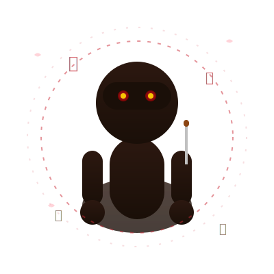

# Goemon Website Media Guidelines

## 📁 Directory Structure

```
assets/
├── images/
│   ├── backgrounds/     # Background images and landscapes
│   ├── characters/      # Character illustrations and avatars
│   └── icons/          # Logos, favicons, and UI icons
└── videos/             # Video content and animations
```

## 🖼️ Image Specifications

### Hero Background Images
- **Location**: `assets/images/backgrounds/`
- **Format**: SVG preferred (scalable), PNG/JPG as fallback
- **Dimensions**: 1200x600px minimum
- **Style**: Traditional Japanese aesthetic (mountains, cherry blossoms, paper texture)
- **Colors**: Warm beige/cream palette (#F5F5DC, #E6D7C3)

### Character Images
- **Location**: `assets/images/characters/`
- **Format**: SVG preferred for illustrations, PNG for detailed art
- **Dimensions**: 400x400px minimum (1:1 aspect ratio)
- **Style**: Traditional Japanese art style (ukiyo-e inspired)
- **Characters**: Ninja aesthetic with traditional elements

### Icons and Logos
- **Location**: `assets/images/icons/`
- **Format**: SVG (required for favicon compatibility)
- **Dimensions**: 200x200px minimum for logos
- **Usage**: Favicon, social media, branding
- **Colors**: Traditional red (#CC2936) and gold (#FFD700) accents

## 🎥 Video Specifications

### Background Videos
- **Location**: `assets/videos/`
- **Formats**: 
  - MP4 (primary) - H.264 codec
  - WebM (fallback) - VP9 codec
- **Dimensions**: 1920x1080px (16:9 aspect ratio)
- **Duration**: 10-30 seconds (looped)
- **Size**: Maximum 5MB for web optimization
- **Content**: Subtle animations, Japanese themes

### Video Guidelines
- **Autoplay**: Muted only (browser compliance)
- **Loop**: Seamless looping for backgrounds
- **Fallback**: Always provide poster image
- **Accessibility**: Include captions when applicable

## 🔧 Implementation Examples

### Basic Image Usage
```html
<!-- Standard Image with Lazy Loading -->


<!-- Image with Fallback -->

<div class="character-main" style="display: none;">🥷</div>
```

### Video Background Usage
```html
<!-- Video Background Container -->
<div class="video-container">
    <video class="video-background" autoplay muted loop playsinline>
        <source src="./assets/videos/demo.mp4" type="video/mp4">
        <source src="./assets/videos/demo.webm" type="video/webm">
        Your browser does not support the video tag.
    </video>
    <div class="video-overlay"></div>
    <div class="video-content">
        <!-- Content goes here -->
    </div>
</div>
```

## 🎨 Design Guidelines

### Color Palette
```css
:root {
    --primary-cream: #F5F5DC;
    --warm-beige: #E6D7C3;
    --traditional-red: #CC2936;
    --deep-red: #8B0000;
    --gold-accent: #FFD700;
    --soft-gold: #F4E4BC;
    --charcoal: #212121;
    --ink-black: #000000;
}
```

### Traditional Japanese Elements
- **Mountains**: Layered silhouettes with depth
- **Sun**: Red/orange radial gradients
- **Cherry Blossoms**: Soft pink floating elements
- **Calligraphy**: Bold Japanese characters
- **Patterns**: Subtle paper textures
- **Birds**: Simple silhouette shapes

## ⚡ Performance Optimization

### Image Optimization
- **Compression**: Use tools like ImageOptim or TinyPNG
- **Format Selection**: 
  - SVG for graphics and icons
  - WebP for photos (with PNG fallback)
  - PNG for transparency
  - JPG for photographs
- **Lazy Loading**: Implement for all non-critical images
- **Preloading**: Only for critical above-the-fold images

### Video Optimization
- **Compression**: Use ffmpeg or similar tools
- **Multiple Formats**: Always provide MP4 and WebM
- **Size Limits**: Keep under 5MB for autoplay videos
- **Poster Images**: Provide static fallback images

## 📱 Responsive Guidelines

### Breakpoints
```css
/* Mobile */
@media (max-width: 480px) {
    .character-image-container { width: 220px; height: 220px; }
}

/* Tablet */
@media (max-width: 768px) {
    .character-image-container { width: 200px; height: 200px; }
    .video-background { opacity: 0.5; }
}

/* Desktop */
@media (max-width: 1024px) {
    .character-image-container { width: 240px; height: 240px; }
}
```

### Mobile Considerations
- Reduce video opacity on mobile
- Smaller image dimensions
- Disable background-attachment: fixed on mobile
- Provide fallbacks for unsupported features

## 🌐 Browser Compatibility

### Image Formats
- **SVG**: All modern browsers ✅
- **WebP**: 95%+ browser support ✅
- **PNG/JPG**: Universal support ✅

### Video Formats
- **MP4 (H.264)**: Universal support ✅
- **WebM (VP9)**: 85%+ browser support ✅
- **Autoplay**: Muted only (all browsers) ⚠️

## 🔒 Security Considerations

### Content Security Policy
```html
<meta http-equiv="Content-Security-Policy" 
      content="img-src 'self' data:; media-src 'self';">
```

### File Validation
- Validate file types server-side
- Sanitize uploaded content
- Use trusted sources for external media

## 🧪 Testing Checklist

### Image Testing
- [ ] All images load correctly
- [ ] Lazy loading works properly
- [ ] Fallbacks display when images fail
- [ ] Alt texts are descriptive
- [ ] Images scale properly on all devices

### Video Testing
- [ ] Videos autoplay when muted
- [ ] Loop seamlessly
- [ ] Multiple format fallbacks work
- [ ] Performance acceptable on mobile
- [ ] Accessible controls available

### Performance Testing
- [ ] Page load time < 3 seconds
- [ ] Images optimized for web
- [ ] Lazy loading reduces initial load
- [ ] No layout shift during loading

## 📝 File Naming Conventions

### Images
- `hero-mountain.svg` - Descriptive, kebab-case
- `goemon-ninja.svg` - Character name with type
- `logo-goemon.svg` - Logo with brand name

### Videos
- `goemon-demo.mp4` - Brand name with purpose
- `background-animation.webm` - Purpose-focused naming

## 🚀 Deployment Notes

### Netlify Specific
- All media files are served from relative paths
- SVG files work as favicons
- Video autoplay supported with muted attribute
- Lazy loading improves Core Web Vitals scores

### CDN Recommendations
- Consider using Cloudinary or similar for dynamic optimization
- Implement responsive image serving
- Use progressive loading for large images